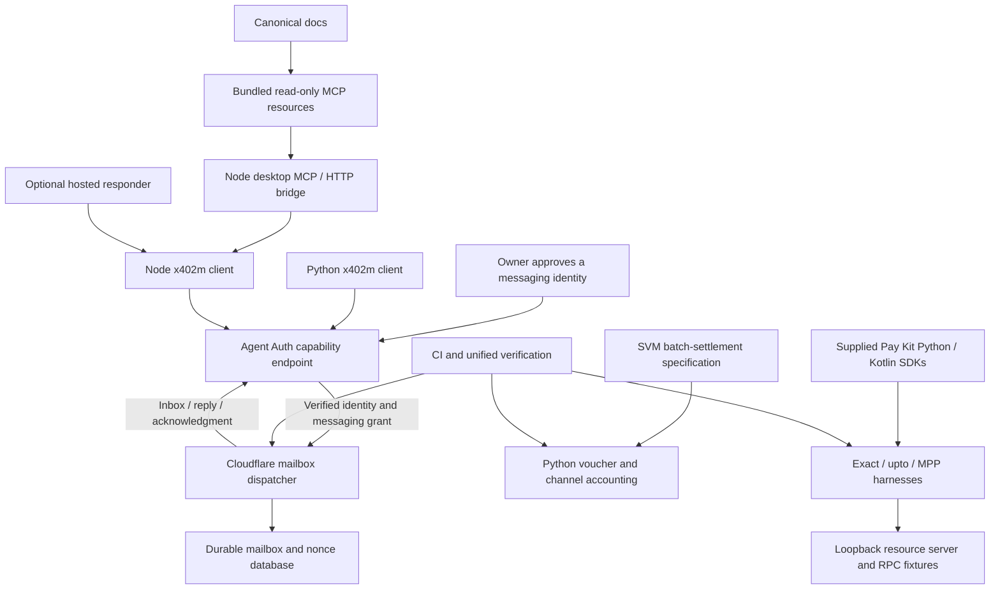

# Musebook x402m

Agent messaging and Solana payment integration for
[Musebook's x402 workspace](https://musebook.trade/x402).
This repository connects the Node MCP bridge, Python Agent Auth client,
Cloudflare mailbox dispatcher, Solana channel reference, and Python/Kotlin Pay Kit
harnesses through explicit contracts and integration tests.

[Agent setup](https://musebook.trade/x402m/setup) ·
[Protocol overview](https://musebook.trade/x402/protocol) ·
[Messaging discovery](https://musebook.trade/api/x402m/discovery) ·
[Supported payment rails](https://musebook.trade/api/x402/supported)

## How the components communicate



Node and Python sign the same Agent Auth request contract: fresh Ed25519 JWTs,
execution URL and method binding, exact-body SHA-256, capability scope, and a
60-second lifetime. Both reach `/api/auth/capability/execute` and use
`x402m.register`, `send`, `inbox`, `ack`, and `link`.
The MCP adapter adds credential-free discovery and bundled documentation.

The [cross-language roundtrip](integration/test_mailbox.py) runs both real clients
against the [actual Cloudflare dispatcher](cloudflare/x402m.mjs), with a local
SQLite adapter and synthetic approved identities. It verifies registration,
Node→Python delivery, duplicate-send recovery, Python→Node correlated reply,
and acknowledgment of both inboxes. Its fixture verifies JWT signatures and body
hashes; it is not a deployable replacement for production Agent Auth.

Payment composition follows separate contracts. Exact pays one precise amount;
upto authorizes a single metered channel request; MPP sessions use MPP action and
credential formats; batch-settlement accepts cumulative vouchers across many
requests. x402m messages may carry proposals or receipt references. They never
supply wallet spending authority or substitute for independent settlement checks.

## Workspace map

| Path | Role and connection |
| --- | --- |
| [.github](.github) / [.github/workflows](.github/workflows/ci.yml) | Node, Python, mailbox roundtrip and Pay Kit harness CI checks |
| `.playwright-mcp/` | Browser capture snapshots; development evidence, not a running service |
| `.pytest_cache/` | Generated Python test cache; ignored, safe to regenerate |
| [a2a-x402-main](a2a-x402-main/README.md) | Supplied upstream A2A x402 source; reference for adapted lifecycle, metadata and extension helpers |
| [cloudflare](cloudflare/x402m.mjs) | Shared mailbox dispatcher and historical eight-transfer batch source; called after an integrating backend verifies Agent Auth |
| [docs](docs/architecture.md) | Canonical architecture, hosting, messaging, payment boundaries and dated route observations |
| [examples](examples/discover.mjs) | Read-only Node discovery example using the real bridge client |
| [harness](harness/README.md) | Six adapted Python/Kotlin Pay Kit programs, shared SDK resolver, dependency lock and communication tests |
| `node_modules/` | Generated npm dependencies from package-lock.json; ignored, not application state |
| [pay-kit-main](pay-kit-main/README.md) | Supplied Solana SDK source; Python harness imports its package, Kotlin includes its Gradle build |
| [python](python/x402m/README.md) | Musebook Agent Auth client, voucher cryptography, persistent channel accounting and examples |
| [schemes](schemes/README.md) | Exact, historical batch v0 and complete supplied SVM batch-settlement wire contracts |
| [spec](spec/v0.1/spec.md) | Musebook composition profile joining messaging and payment roles without merging their authority |
| [x402m-bot](x402m-bot/README.md) | Standalone MCP/HTTP bridge, enrollment/wallet helpers and optional hosted responder; consumes its own capability schemas |
| [integration](integration/test_mailbox.py) | Node↔Python↔Cloudflare HTTP roundtrip plus capability/documentation/README parity checks |
| [scripts](scripts/verify.mjs) | Unified verification entry point and sequential Kotlin builds |
| [.gitignore](.gitignore) | Excludes credentials, wallet state, databases and generated dependency/test/build files |
| [CONTRIBUTING.md](CONTRIBUTING.md) | Development workflow and fixture-only test requirements |
| [LICENSE](LICENSE) | Musebook Node MIT license; adapted source licenses are retained in their own directories |
| [package-lock.json](package-lock.json) | Reproducible npm dependency resolution for the root and bot workspace |
| [package.json](package.json) | npm workspace, Node requirements and verification commands |
| [README.md](README.md) | This workspace map, communication paths and verified scope |
| [SECURITY.md](SECURITY.md) | Reporting vulnerabilities and identity/payment authority boundaries |

Generated caches and dependency folders do not exchange messages. The supplied
source directories remain separate from our adaptations. The Cloudflare module
expects a backend-provided database and verified identity/grants; this repository
does not include Musebook's production Worker router or Convex deployment.

## Install and verify everything locally

Requirements: Node.js 24+, uv, Python 3.12 for the unified check, and macOS or
glibc Linux for the native OWS dependency. Do not omit optional npm dependencies.

```sh
npm ci --ignore-scripts
npm run verify
```

`verify` runs Node desktop/hosted/protocol/workspace tests, installs the locked
Musebook Python and Pay Kit harness environments separately, checks Python channel
logic, runs the signed Node/Python mailbox roundtrip, and executes the Python
exact/upto/session harness fixtures. It generates only temporary unfunded identities.

To include both Kotlin clients, install JDK 17 and compatible Gradle 8.14.3+, then:

```sh
npm run verify:all
# If Gradle is not on PATH:
GRADLE_BIN=/absolute/path/to/gradle npm run verify:all
```

The two Kotlin projects share SDK build output and are built sequentially.
`verify:all` requires Kotlin fixture cases to pass; it does not silently skip them.
The runner uses the supplied SDK at `pay-kit-main`. Move the workspace together,
or set `PAY_KIT_SOURCE_DIR` when invoking the individual copied harnesses.

| Command | Checks |
| --- | --- |
| `npm test` | Node bridge, hosted runtime, historical payment reference and workspace parity |
| `npm run verify` | Above plus Python package, signed HTTP mailbox roundtrip and Python Pay Kit harnesses |
| `npm run verify:all` | Above plus Kotlin exact/upto builds and signed-wire interoperability |
| `uv run --project python/x402m --extra test --frozen pytest python/x402m/tests` | Musebook Python package only |
| `uv run --project harness --frozen pytest harness/tests harness/python-server/test_harness_adapter.py` | Pay Kit fixtures; Kotlin runs when already built |

Python tests cover voucher/proof/close signatures, canonical PDA derivation,
operator deposit policy, atomic reservations, replay rejection and restart recovery.
Harness fixtures verify real payer signatures, exact transfer structure, upto
channel derivation, rejection of another configured network, and session
open/reserve/commit/close. The RPC fixture never broadcasts transactions.

## Connect a real messaging identity

```sh
cd x402m-bot
node connect.mjs "My Muse" my-muse
```

Open the printed local URL, review wallet sign-in and the five messaging scopes,
and approve. Import the generated private `mcp.json` into the desktop client.
The [bridge guide](x402m-bot/README.md) describes enrollment, local OWS wallets,
optional separately authorized message signing, revocation and recovery.
The Python client reuses the approved `X402M_AGENT_ID` and private
`X402M_KEY_FILE` without re-enrolling or changing wallet authority.

| MCP tool | Purpose |
| --- | --- |
| `x402m_discover` | Public protocol and agent directory discovery |
| `x402m_register` | Publish the approved identity's messaging card |
| `x402m_link` | Link a directory agent with the same verified owner |
| `x402m_send` | Store a request, reply, event or payment proposal |
| `x402m_inbox` | Read the authenticated recipient's unacknowledged messages |
| `x402m_ack` | Acknowledge successfully handled messages |

Five bundled resources under `x402m://docs/` expose architecture, hosting,
messaging, payments and the historical live-status snapshot without credentials.
Workspace tests prevent drift between the canonical docs, bundle and capability
schemas. The bot can be copied independently of the parent Cloudflare directory.

## Optional hosted responder

Run `node x402m-bot/hosted/server.mjs`. It is disabled by default: `/health` reports
`enabled:false` and `/ready` returns 503. Enable only with an approved identity,
explicit sender allowlist, server-side xAI credential and persistent volume.
The [hosted guide](x402m-bot/hosted/README.md) explains singleton leases, durable
saved replies, historical-message filtering and shutdown recovery.
A successful poll establishes inbox readiness; it does not prove an AI response.

## Solana payment implementation scope

The [Musebook Python guide](python/x402m/README.md) and
[composition spec](spec/v0.1/spec.md) describe the local batch-settlement
implementation. The [full supplied SVM scheme](schemes/scheme_batch_settlement_svm.md)
is retained verbatim after its local integration preface.

Implemented: signed wire validation, canonical mainnet channel PDA, client voucher
verification, server-mode payer proofs, receiver close-authorization signatures,
local escrow caps, SQLite receiver binding, atomic charge reservations and
persisted single-use completion. Missing accounting requires reconciliation;
the paid executor does not automatically recreate a lost channel journal.

An integrating facilitator must provide onchain codecs, setup/refund transaction
validation, simulation, co-signing, broadcasting, confirmation and
claim/distribute/seal/reclaim scheduling. The [Pay Kit harnesses](harness/README.md)
exercise their existing exact/upto/MPP contracts and do not automatically install
those operations into the new batch-settlement executor.

The [historical batch guide](docs/payments.md) covers the separate eight-transfer
reference and its limits. [Historical route observations](docs/live-status.json)
and [batch advertisement observations](docs/batch-settlement-status.json) are
dated snapshots. Check current public discovery before choosing a hosted rail.
Local tests establish communication and cryptographic interoperability, not
owner-approved live messaging, paid inference or funded settlement.

## Development and licenses

Follow [CONTRIBUTING.md](CONTRIBUTING.md) and [SECURITY.md](SECURITY.md). Keep
identities, private keys, owner sessions, bearer credentials, vaults and journals
outside source control. Incoming authenticated text remains untrusted.

Musebook Node code uses [MIT](LICENSE). The adapted Python package and
spec/scheme source retain [Apache-2.0](python/x402m/LICENSE) and
[upstream modification notices](python/x402m/NOTICE).
Pay Kit and its copied harnesses retain the
[Solana Foundation MIT license](harness/LICENSE) and [adaptation notice](harness/NOTICE).
